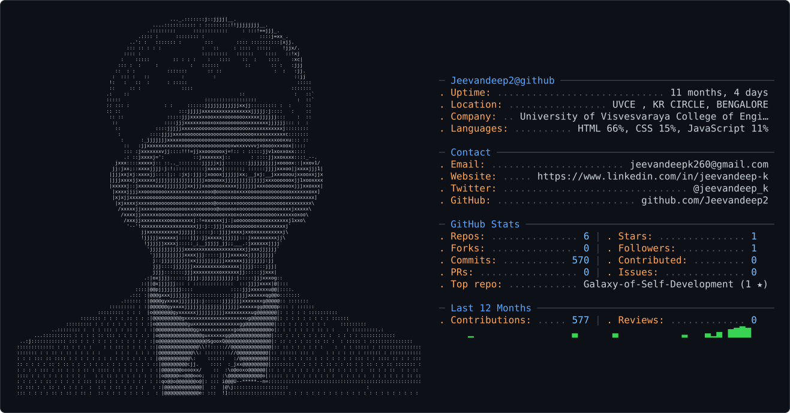

<picture>
  <source media="(prefers-color-scheme: dark)" srcset="dark_mode.svg" />
  <!-- <source media="(prefers-color-scheme: light)" srcset="light_mode.svg" /> -->
  <source media="(prefers-color-scheme: light)" srcset="dark_mode.svg" />
  
</picture>

<!-- ANIMATED HEADER -->

  

<!-- TYPING ANIMATION -->

  

<!-- ANIMATED DIVIDER -->

<!-- BADGES ROW -->

  
  &nbsp;

  
  &nbsp;

  
  &nbsp;

  

 

<!-- SNAKE ANIMATION -->

  <picture>
    <source media="(prefers-color-scheme: dark)" srcset="https://raw.githubusercontent.com/Jeevandeep2/Jeevandeep2/output/github-contribution-grid-snake-dark.svg"/>
    <source media="(prefers-color-scheme: light)" srcset="https://raw.githubusercontent.com/Jeevandeep2/Jeevandeep2/output/github-contribution-grid-snake.svg"/>
    
  </picture>

 

## 📊 GitHub Analytics

  

  

  

  

  

## 👋 About Me

Hello! I'm Jeevandeep, an AI & ML engineering student passionate about innovation, technology, and social impact. Excited to connect, learn, and collaborate with like-minded people.

🚀 About Me  As an AI&DS Engineering student exploring the intersection of AI, Data Science, Machine Learning, and innovation. I love taking challenging ideas, breaking them into systems, and turning them into working products.  - 🔭 I'm currently working on: AI-powered applications, ML projects, and OPES EDGE — a multi-domain intelligent technology platform. - 🤝 I'm looking to collaborate on: AI/ML projects, open-source, hackathons, research-oriented projects, and startup ideas. - 🧠 I'm looking for help with: Advanced AI/ML, scalable system design, and transforming prototypes into production-ready products. - 🌱 I'm currently learning: Deep Learning, Data Science, Generative AI, intelligent systems, backend architecture, and emerging AI technologies. - 💬 Ask me about: AI, ML, Data Science, Python, AI tools, project architecture, hackathons, and building innovative projects. - ⚡ Fun fact: I believe the best way to learn technology is to build with it, break it, fix it, and build something better

### 🔥 What Drives Me

- 🤖 **AI-First Mindset** — Every problem is a system waiting to be intelligent
- 💡 **Builder's DNA** — Prototypes → Products → Production
- 🌐 **Social Impact** — Technology that serves people
- 🧩 **System Thinker** — I break complexity into elegant architecture

## 💜 "First, solve the problem. Then, write the code." 💜

## 🛠️ Tech Arsenal
                                       

 

  

  

  
  
  
  
  
  

 

  

